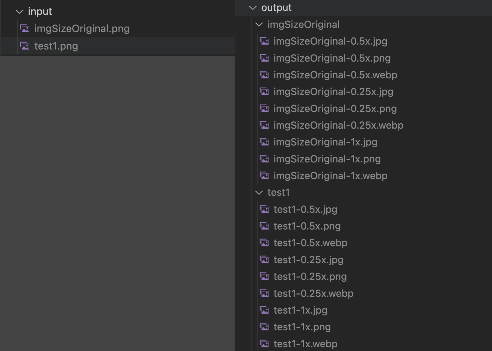

# Image Resizer
This is a Node.js script that resizes images to different sizes and scales and saves them in different formats. The script uses the sharp library to handle the image manipulation.

## Features
Resizes images to specified sizes and scales
Saves images in different formats (PNG, JPG, and WebP)
Creates separate output folders for each image with the name of the image
Clears the output folder for each image before saving the resized images
Logs the success of each conversion
## Requirements
Node.js and npm installed on your computer
The `sharp` library installed in your project (you can install it by running `npm install sharp` in your terminal)
## Usage
Clone or download the repository
Navigate to the project folder in your terminal
Run `npm install` to install the required libraries
Place the images you want to resize in the `input` folder
Run `node convert.js` to start the script
The resized images will be saved in the `output` folder
## Configuration
You can configure the sizes, scales, and formats by modifying the `sizes`, `scales`, and `formats` arrays in the `convert.js` file.

## Note
The script assumes that all the images in the `input` folder are in a supported format by the `sharp` library. If an image is in an unsupported format, the script will log an error and skip the image.

## This repo is made with 10 steps of prompts with ChatGPT
